<div align="center">

<!-- ANIMATED TYPING HERO -->


<!-- FUTURISTIC TYPING ANIMATION -->
<a href="https://git.io/typing-svg"></a>

<!-- PREMIUM BADGES -->
<p align="center">
  
  
  
  
  
</p>

<!-- DYNAMIC STATS -->
<p align="center">
  
  
  
  
</p>

<!-- NEON DIVIDER -->


</div>

## 🌌 **Overview**

<div align="center">

**Multi-Agent Research Assistant** is a cutting-edge autonomous research system that orchestrates specialized AI agents to conduct deep web research and generate professional-grade reports. Built with enterprise-level architecture and powered by state-of-the-art LLMs, this system represents the future of automated intelligence gathering.

</div>

### ✨ **The Vision**

Imagine having a team of AI researchers working 24/7, each with specialized expertise, collaborating seamlessly to deliver comprehensive research reports in minutes. This isn't science fiction—it's what we've built.

```mermaid
graph LR
    A[🎯 User Query] --> B[🔍 Search Agent]
    B --> C[📖 Reader Agent]
    C --> D[✍️ Writer Agent]
    D --> E[🎨 Critic Agent]
    E --> F[📊 Final Report]
    style A fill:#a277ff,stroke:#7c3aed,stroke-width:3px,color:#fff
    style F fill:#22c55e,stroke:#16a34a,stroke-width:3px,color:#fff
    style B fill:#3b82f6,stroke:#2563eb,stroke-width:2px,color:#fff
    style C fill:#8b5cf6,stroke:#7c3aed,stroke-width:2px,color:#fff
    style D fill:#ec4899,stroke:#db2777,stroke-width:2px,color:#fff
    style E fill:#f59e0b,stroke:#d97706,stroke-width:2px,color:#fff
```

<div align="center">



</div>

<!-- WAVE SEPARATOR -->


## 🤖 **Meet the Agents**

<table>
<tr>
<td width="25%" align="center">

### 🔍 **Search Agent**


**The Explorer**

Scours the web using Tavily Search API to find the most relevant, recent, and authoritative sources for any research topic.

**Capabilities:**
- Real-time web search
- Source ranking
- Relevance filtering
- URL extraction

</td>
<td width="25%" align="center">

### 📖 **Reader Agent**


**The Analyst**

Scrapes and extracts meaningful information from discovered sources using BeautifulSoup and intelligent parsing algorithms.

**Capabilities:**
- Content extraction
- HTML parsing
- Data cleaning
- Information synthesis

</td>
<td width="25%" align="center">

### ✍️ **Writer Agent**


**The Composer**

Transforms raw intelligence into structured, professional research reports with proper citations and formatting.

**Capabilities:**
- Report generation
- Content structuring
- Citation management
- Professional formatting

</td>
<td width="25%" align="center">

### 🎨 **Critic Agent**


**The Perfectionist**

Reviews, scores, and iteratively improves reports to ensure maximum quality and accuracy.

**Capabilities:**
- Quality assessment
- Fact verification
- Style improvement
- Iterative refinement

</td>
</tr>
</table>

<!-- GRADIENT DIVIDER -->


## 🚀 **Key Features**

<div align="center">

| Feature | Description | Status |
|---------|-------------|--------|
| 🤝 **Multi-Agent Orchestration** | Specialized agents collaborate seamlessly | ✅ Active |
| 🌐 **Live Web Research** | Real-time data from across the internet | ✅ Active |
| 🧠 **AI-Powered Analysis** | Advanced LLM reasoning with Mistral AI | ✅ Active |
| 📝 **Professional Reports** | Publication-ready formatted documents | ✅ Active |
| 🔄 **Iterative Refinement** | Self-improving quality through critic feedback | ✅ Active |
| 🎯 **Smart Source Selection** | Intelligent ranking and filtering | ✅ Active |
| ⚡ **Blazing Fast** | Async operations for maximum speed | ✅ Active |
| 🎨 **Beautiful UI** | Streamlit-powered interactive interface | ✅ Active |

</div>

<details>
<summary><b>🌟 Feature Deep Dive (Click to Expand)</b></summary>

<br>

### 🔥 **Autonomous Operation**
The system requires minimal human intervention. Simply provide a research topic, and watch as the agents autonomously:
- Search for sources
- Extract information
- Generate reports
- Self-critique and improve

### 🎯 **Intelligent Agent Coordination**
Built on LangChain's agent framework, our system orchestrates complex workflows with:
- Dynamic task allocation
- Inter-agent communication
- State management
- Error recovery

### 📊 **Research Quality**
Every report goes through rigorous quality control:
- Multi-source verification
- Fact-checking protocols
- Citation integrity
- Readability optimization

### ⚡ **Performance Optimized**
- Concurrent web requests
- Efficient token usage
- Smart caching mechanisms
- Resource-aware processing

</details>

<!-- NEON DIVIDER -->


## 🏗️ **System Architecture**

<div align="center">

```ascii
╔══════════════════════════════════════════════════════════════════╗
║                    🎯 User Interface (Streamlit)                  ║
╚══════════════════════════════════════════════════════════════════╝
                                  │
                                  ▼
╔══════════════════════════════════════════════════════════════════╗
║                  🧠 Multi-Agent Orchestrator                      ║
║                        (LangChain)                                ║
╚══════════════════════════════════════════════════════════════════╝
         │              │              │              │
         ▼              ▼              ▼              ▼
    ┌────────┐    ┌────────┐    ┌────────┐    ┌────────┐
    │   🔍   │    │   📖   │    │   ✍️   │    │   🎨   │
    │ Search │───▶│ Reader │───▶│ Writer │───▶│ Critic │
    │ Agent  │    │ Agent  │    │ Agent  │    │ Agent  │
    └────────┘    └────────┘    └────────┘    └────────┘
         │              │              │              │
         ▼              ▼              ▼              ▼
    ┌────────┐    ┌────────┐    ┌────────┐    ┌────────┐
    │ Tavily │    │Beautiful│   │ Mistral│    │Analysis│
    │  API   │    │  Soup   │   │   AI   │    │ Engine │
    └────────┘    └────────┘    └────────┘    └────────┘
         │              │              │              │
         └──────────────┴──────────────┴──────────────┘
                            ▼
              ╔═══════════════════════════╗
              ║  📊 Research Report       ║
              ╚═══════════════════════════╝
```

</div>

<!-- WAVE SEPARATOR -->


## 🛠️ **Tech Stack**

<div align="center">

### **Core Technologies**

<table>
<tr>
<td align="center" width="20%">

<br><strong>Python 3.9+</strong>
<br><sub>Core Language</sub>
</td>
<td align="center" width="20%">

<br><strong>LangChain</strong>
<br><sub>Agent Framework</sub>
</td>
<td align="center" width="20%">

<br><strong>Mistral AI</strong>
<br><sub>LLM Engine</sub>
</td>
<td align="center" width="20%">

<br><strong>Streamlit</strong>
<br><sub>Web Interface</sub>
</td>
<td align="center" width="20%">

<br><strong>BeautifulSoup</strong>
<br><sub>Web Scraping</sub>
</td>
</tr>
</table>

### **Additional Tools**


</div>

<!-- GRADIENT DIVIDER -->


## 📦 **Installation**

<div align="center">

### **Quick Start in 3 Minutes** ⚡

</div>

### **Prerequisites**

```bash
# Check Python version (3.9+ required)
python --version

# Ensure pip is updated
pip install --upgrade pip
```

### **Step 1: Clone the Repository**

```bash
git clone https://github.com/yourusername/multi-agent-research-assistant.git
cd multi-agent-research-assistant
```

### **Step 2: Create Virtual Environment**

```bash
# Create virtual environment
python -m venv venv

# Activate virtual environment
# On Windows:
venv\Scripts\activate
# On macOS/Linux:
source venv/bin/activate
```

### **Step 3: Install Dependencies**

```bash
pip install -r requirements.txt
```

<details>
<summary><b>📋 Full Requirements List (Click to Expand)</b></summary>

```txt
langchain>=0.1.0
langchain-community>=0.0.10
langchain-mistralai>=0.0.1
streamlit>=1.29.0
beautifulsoup4>=4.12.0
requests>=2.31.0
python-dotenv>=1.0.0
tavily-python>=0.3.0
lxml>=4.9.0
```

</details>

### **Step 4: Configure API Keys**

Create a `.env` file in the project root:

```bash
# .env file
MISTRAL_API_KEY=your_mistral_api_key_here
TAVILY_API_KEY=your_tavily_api_key_here
```

<details>
<summary><b>🔑 How to Get API Keys (Click to Expand)</b></summary>

<br>

#### **Mistral AI API Key**
1. Visit [console.mistral.ai](https://console.mistral.ai)
2. Sign up or log in
3. Navigate to API Keys section
4. Generate a new API key
5. Copy and paste into `.env` file

#### **Tavily Search API Key**
1. Visit [tavily.com](https://tavily.com)
2. Create an account
3. Go to API section
4. Generate API key
5. Copy and paste into `.env` file

</details>

### **Step 5: Launch the Application**

```bash
streamlit run app.py
```

<div align="center">

🎉 **Your Multi-Agent Research Assistant is now running!** 🎉

The app will automatically open in your browser at `http://localhost:8501`

</div>

<!-- NEON DIVIDER -->


## 🎯 **Usage**

### **Basic Workflow**

```python
# 1. Enter your research topic in the Streamlit interface
research_topic = "Latest advancements in quantum computing"

# 2. Click "Start Research"
# The system will automatically:
#   - Search for relevant sources (Search Agent)
#   - Extract information (Reader Agent)
#   - Generate report (Writer Agent)
#   - Review and improve (Critic Agent)

# 3. Download your professional research report
```

### **Advanced Configuration**

<details>
<summary><b>⚙️ Customize Agent Behavior (Click to Expand)</b></summary>

```python
# config.py
AGENT_CONFIG = {
    "search_agent": {
        "max_sources": 10,
        "search_depth": "advanced",
        "time_range": "recent"
    },
    "reader_agent": {
        "extraction_mode": "comprehensive",
        "timeout": 30
    },
    "writer_agent": {
        "report_style": "academic",
        "citation_format": "APA"
    },
    "critic_agent": {
        "quality_threshold": 0.85,
        "max_iterations": 3
    }
}
```

</details>

<!-- WAVE SEPARATOR -->


## 📁 **Project Structure**

```
multi-agent-research-assistant/
│
├── 📱 app.py                    # Streamlit main application
├── 🤖 agents/
│   ├── __init__.py
│   ├── search_agent.py          # Web search orchestrator
│   ├── reader_agent.py          # Content extraction specialist
│   ├── writer_agent.py          # Report generation engine
│   └── critic_agent.py          # Quality assurance reviewer
│
├── 🔧 utils/
│   ├── __init__.py
│   ├── config.py                # Configuration management
│   ├── helpers.py               # Utility functions
│   └── prompts.py               # Agent prompt templates
│
├── 🧪 tests/
│   ├── test_agents.py
│   ├── test_integration.py
│   └── test_utils.py
│
├── 📊 data/
│   ├── reports/                 # Generated research reports
│   └── cache/                   # Temporary cache storage
│
├── 📝 docs/
│   ├── ARCHITECTURE.md
│   ├── API_REFERENCE.md
│   └── CONTRIBUTING.md
│
├── 🐳 .env.example              # Environment variables template
├── 📋 requirements.txt          # Python dependencies
├── 🔒 .gitignore
├── 📜 LICENSE
└── 📖 README.md
```

<!-- GRADIENT DIVIDER -->


<!-- NEON DIVIDER -->


## 🚀 **Deployment**

<div align="center">

### **Deploy to Cloud Platforms**

</div>

<table>
<tr>
<td width="33%" align="center">

### ☁️ **Streamlit Cloud**

```bash
# Push to GitHub
git push origin main

# Visit share.streamlit.io
# Connect repository
# Deploy!
```

[](https://share.streamlit.io)

</td>
<td width="33%" align="center">

### 🐳 **Docker**

```bash
# Build image
docker build -t research-assistant .

# Run container
docker run -p 8501:8501 research-assistant
```

[](https://docker.com)

</td>
<td width="33%" align="center">

### ☸️ **Kubernetes**

```bash
# Apply configuration
kubectl apply -f k8s/

# Verify deployment
kubectl get pods
```

[](https://kubernetes.io)

</td>
</tr>
</table>

<details>
<summary><b>🐳 Docker Configuration (Click to Expand)</b></summary>

```dockerfile
FROM python:3.9-slim

WORKDIR /app

COPY requirements.txt .
RUN pip install --no-cache-dir -r requirements.txt

COPY . .

EXPOSE 8501

CMD ["streamlit", "run", "app.py", "--server.address", "0.0.0.0"]
```

</details>

<!-- WAVE SEPARATOR -->


<details>
<summary><b>🔮 Long-term Vision (Click to Expand)</b></summary>

- **Specialized Research Domains**: Pre-trained agents for medical, legal, financial research
- **Enterprise Features**: Team collaboration, admin dashboard, usage analytics
- **Advanced Reasoning**: Multi-step reasoning chains, causal inference
- **Knowledge Graphs**: Automatic knowledge graph construction from research
- **API Platform**: RESTful API for programmatic access
- **Plugin Ecosystem**: Community-built agent extensions

</details>

<!-- GRADIENT DIVIDER -->


## ❓ **FAQ**

<details>
<summary><b>How accurate are the research reports?</b></summary>

<br>

The accuracy depends on:
- Quality of web sources found by Search Agent
- Mistral AI's comprehension capabilities
- Critic Agent's verification process

We recommend using this as a starting point and verifying critical facts independently.

</details>

<details>
<summary><b>Can I use different LLMs?</b></summary>

<br>

Yes! The system is designed to be LLM-agnostic. You can swap Mistral AI for:
- OpenAI GPT-4
- Anthropic Claude
- Google PaLM
- Open-source models via Ollama

Just modify the LLM initialization in `agents/base.py`.

</details>

<details>
<summary><b>What are the API costs?</b></summary>

<br>

Approximate costs per research report:
- **Mistral AI**: ~$0.10 - $0.50 (depending on report length)
- **Tavily Search**: ~$0.02 - $0.05

Total: **$0.12 - $0.55 per report**

</details>

<details>
<summary><b>How long does a research report take?</b></summary>

<br>

Typical timelines:
- Simple topics: 2-5 minutes
- Complex topics: 5-10 minutes
- Deep research: 10-20 minutes

Time varies based on:
- Number of sources
- Content extraction complexity
- Critic iterations needed

</details>

<details>
<summary><b>Can I customize agent prompts?</b></summary>

<br>

Absolutely! All agent prompts are in `utils/prompts.py`. You can:
- Modify writing styles
- Change report formats
- Adjust quality criteria
- Customize search parameters

</details>

<details>
<summary><b>Is this production-ready?</b></summary>

<br>

The system is production-ready for:
- ✅ Personal research projects
- ✅ Internal team tools
- ✅ MVP/prototype development

For enterprise deployment, consider:
- Adding authentication
- Implementing rate limiting
- Setting up monitoring
- Adding error recovery

</details>

<!-- NEON DIVIDER -->


## 🤝 **Contributing**

<div align="center">

### **We Love Contributions!** 💜


</div>

### **How to Contribute**

1. **Fork the repository**
2. **Create your feature branch**
   ```bash
   git checkout -b feature/AmazingFeature
   ```
3. **Commit your changes**
   ```bash
   git commit -m 'Add some AmazingFeature'
   ```
4. **Push to the branch**
   ```bash
   git push origin feature/AmazingFeature
   ```
5. **Open a Pull Request**

### **Contribution Guidelines**

- 📝 Follow PEP 8 style guide
- ✅ Write tests for new features
- 📚 Update documentation
- 💬 Use clear commit messages
- 🎯 Keep PRs focused and atomic

<div align="center">

[](https://github.com/yourusername/multi-agent-research/graphs/contributors)
[](https://github.com/yourusername/multi-agent-research/pulls)
[](https://github.com/yourusername/multi-agent-research/issues)

</div>

<!-- WAVE SEPARATOR -->


## 📄 **License**

<div align="center">

This project is licensed under the **MIT License** - see the [LICENSE](LICENSE) file for details.

```
MIT License

Copyright (c) 2024 Multi-Agent Research Assistant

Permission is hereby granted, free of charge, to any person obtaining a copy
of this software and associated documentation files (the "Software"), to deal
in the Software without restriction, including without limitation the rights
to use, copy, modify, merge, publish, distribute, sublicense, and/or sell
copies of the Software...
```

[](https://opensource.org/licenses/MIT)

</div>

<!-- GRADIENT DIVIDER -->


## 🌟 **Acknowledgments**

<div align="center">

### **Built With Amazing Technologies**

Special thanks to:
- **LangChain Team** - For the incredible agent framework
- **Mistral AI** - For powerful language models
- **Tavily** - For excellent search API
- **Streamlit** - For making beautiful UIs easy
- **Open Source Community** - For inspiration and support

</div>

<!-- NEON DIVIDER -->


## 📞 **Contact & Support**

<div align="center">

### **Get in Touch**

<a href="https://twitter.com/yourusername">
  
</a>
<a href="https://linkedin.com/in/yourusername">
  
</a>
<a href="https://discord.gg/yourdiscord">
  
</a>
<a href="mailto:your.email@example.com">
  
</a>

<br><br>

### **Support the Project**

If you find this project helpful, consider:

<a href="https://www.buymeacoffee.com/yourusername">
  
</a>
<a href="https://github.com/sponsors/yourusername">
  
</a>

</div>

<!-- NEON DIVIDER -->


### ⭐ **Don't forget to star this repository!** ⭐


**Made with 🤖 by the future of AI research**

</div>

---

<div align="center">

<sub>Built with LangChain 🦜 • Powered by Mistral AI 🚀 • Deployed on Streamlit ☁️</sub>

<br>

<a href="#-overview">⬆ Back to Top</a>

</div>
